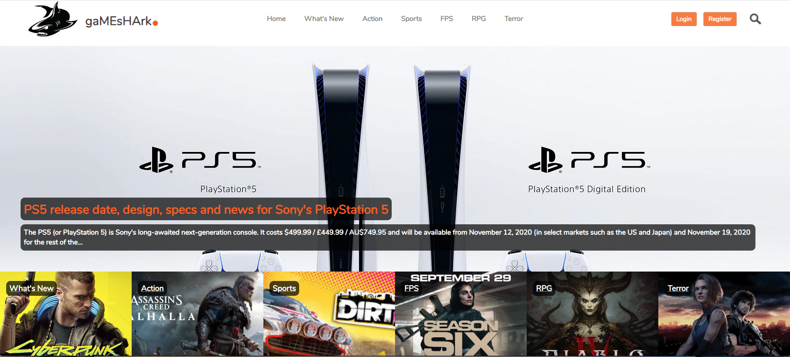

# Gameshark Articles

It's a games article desktop app that allows users to post their articles in several categories like What's New, Action, Sports, FPS, RPG e Terror. Another user can read an article and upvate or downvote any created article. These articles are ordered to show at the front banner the article with the best score from this votes in total. In the categories section, the user can see the articles for that particular category ordered by the last one created, this last one is the one displayed in the category banner at "home" page.



## Built With

- Ruby v2.7.0
- Ruby on Rails v5.2.4.4
- Postgres v13.0
- Bootstrap-sass v3.4
- Sass-rails v6.0

## Live Demo

[Gameshark-articles-ror](https://gameshark-articles-ror.herokuapp.com/)


### Prerequisites

- Ruby: 2.6.3
- Rails: 5.2.3
- Postgres: >=9.5

## Getting Started

- First get a local copy of the project by forking it or just clone it typing this at your terminal inside your favorite folder:
```
$ git clone git@github.com:luciano-ilha/gameshark_articles_ror.git
```

- CD into the repository

### Setup

Install gems with:

```
$ bundle install
```
- Install postgress in your machine and configure `database.yml` file properly. Example:

```
default: &default
  adapter: postgresql
  pool: <%= ENV.fetch("RAILS_MAX_THREADS") { 5 } %>
  timeout: 5000
  encoding: unicode
  database: gameshark_articles_ror
  username: lucianoilhacarbonell
  password: dev12345
  host: localhost

development:
  <<: *default
  adapter: postgresql
  pool: <%= ENV.fetch("RAILS_MAX_THREADS") { 5 } %>
  timeout: 5000
  encoding: utf8
  database: gameshark_articles_ror
  username: lucianoilhacarbonell
  password: dev12345
  host: localhost

# Warning: The database defined as "test" will be erased and
# re-generated from your development database when you run "rake".
# Do not set this db to the same as development or production.
test:
  <<: *default
  adapter: postgresql
  pool: <%= ENV.fetch("RAILS_MAX_THREADS") { 5 } %>
  timeout: 5000
  encoding: utf8
  database: gameshark_articles_ror
  username: lucianoilhacarbonell
  password: dev12345
  host: localhost

production:
  <<: *default
  adapter: postgresql
  pool: <%= ENV.fetch("RAILS_MAX_THREADS") { 5 } %>
  timeout: 5000
  encoding: utf8
  database: <%= ENV['DATABASE_URL'] %>
  username: lucianoilhacarbonell
  password: dev12345
  host: localhost
```
- Run "db:create":
```
$ rails db:create
```
- Then migrate with:
```
$ rails db:migrate
```  
  
### Test

- Run rails spec command:
 ```
$ rails spec
 ```

### Github Actions

To make sure the linters' checks using Github Actions works properly, you should follow the next steps:

1. On your recently forked repo, enable the GitHub Actions in the Actions tab.
2. Create the `feature/branch` and push.
3. Start working on your milestone as usual.
4. Open a PR from the `feature/branch` when your work is done.


### Usage

- Start server with:

```
$ rails server
```

Open `http://localhost:3000/` in your browser.


### Deployment

 - Heroku

## ✒️ Authors <a name = "author"></a>

👤 **Luciano Ilha Carbonel**

- Github: [@Luciano ilha](https://github.com/luciano-ilha)
- Twitter: [@CarbonellIlha](https://twitter.com/CarbonellIlha )
- Linkedin: [@Luciano ilha](https://www.linkedin.com/in/luciano-carbonell/)

## 🤝 Contributing

Contributions, issues and feature requests are welcome!

Feel free to check the fork this repo and create pull request if you want to make changes.

## Show your support :muscle:

Give a ⭐️ if you like this project!

## :thumbsup: Acknowledgements

- Microverse  
- ThOdinProject

## Credits to

1 . Nelson Sakwa at Behance
[link](https://www.behance.net/gallery/14554909/liFEsTlye-Mobile-version)
